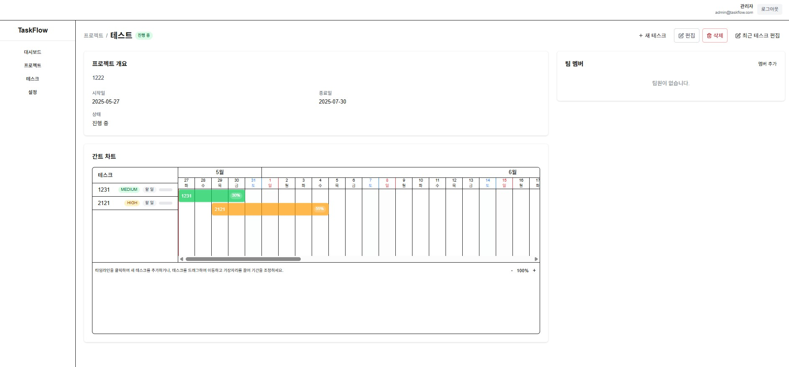

<div align="center">

</div>

# TaskFlow - 태스크 관리 시스템

## 프로젝트 개요

TaskFlow는 프로젝트와 태스크를 효율적으로 관리할 수 있는 웹 애플리케이션입니다. 사용자 인증, 프로젝트 생성 및 관리, 태스크 할당 및 진행 상황 추적 기능을 제공합니다.

## 기술 스택

### 프론트엔드
- Next.js 15.3.2 (React 19)
- TypeScript
- Tailwind CSS
- Zustand (상태 관리)
- React Hook Form (폼 관리)
- Framer Motion (애니메이션)
- React Beautiful DnD (드래그 앤 드롭)
- Recharts (데이터 시각화)

### 백엔드
- Next.js API Routes
- Prisma ORM
- SQLite 데이터베이스
- NextAuth.js (인증)

## 주요 기능

### 사용자 관리
- 회원가입 및 로그인 기능
- 사용자 권한 관리 (관리자, 편집자, 뷰어)
- 사용자 프로필 관리

### 프로젝트 관리
- 프로젝트 생성, 조회, 수정, 삭제 (CRUD)
- 프로젝트 상태 관리 (계획 중, 진행 중, 완료됨)
- 프로젝트 진행률 자동 계산
- 프로젝트별 태스크 관리

### 태스크 관리
- 태스크 생성, 조회, 수정, 삭제 (CRUD)
- 태스크 우선순위 설정 (낮음, 중간, 높음, 긴급)
- 태스크 상태 관리 (할 일, 진행 중, 완료됨)
- 태스크 담당자 할당
- 서브 태스크 및 태스크 간 의존성 관리

### 대시보드
- 프로젝트 및 태스크 현황 요약
- 데이터 시각화 (차트 및 그래프)

## 데이터 모델

### 사용자 (User)
- 기본 정보: ID, 이름, 이메일, 비밀번호, 프로필 이미지
- 역할: 관리자(ADMIN), 편집자(EDITOR), 뷰어(VIEWER)
- 관계: 프로젝트, 태스크

### 프로젝트 (Project)
- 기본 정보: ID, 이름, 설명, 시작일, 종료일
- 상태: 계획 중(PLANNING), 진행 중(IN_PROGRESS), 완료됨(COMPLETED)
- 관계: 사용자, 태스크

### 태스크 (Task)
- 기본 정보: ID, 제목, 설명, 시작일, 종료일, 진행률
- 우선순위: 낮음(LOW), 중간(MEDIUM), 높음(HIGH), 긴급(URGENT)
- 상태: 할 일(TODO), 진행 중(IN_PROGRESS), 완료됨(COMPLETED)
- 관계: 프로젝트, 담당자, 부모 태스크, 서브 태스크, 의존성

## 사용자 인터페이스

### 레이아웃
- 반응형 디자인 (모바일, 태블릿, 데스크탑)
- 메인 레이아웃: 헤더, 사이드바, 콘텐츠 영역
- 사이드바 메뉴: 대시보드, 프로젝트, 태스크, 설정

### 주요 화면
- 로그인/회원가입 페이지
- 대시보드 페이지
- 프로젝트 목록 및 상세 페이지
- 태스크 목록 및 상세 페이지
- 설정 페이지

## 실행 방법

### 설치 방법

1. 저장소 복제
```bash
git clone https://github.com/jinyounghwa/task_management.git
cd taskflow
```

2. 의존성 설치
```bash
npm install
# 또는
yarn
```

3. 데이터베이스 설정
```bash
npx prisma migrate dev --name init
```

4. 개발 서버 실행
```bash
npm run dev
# 또는
yarn dev
```

5. 브라우저에서 접속: http://localhost:3000

### 배포 방법

1. 프로덕션 빌드
```bash
npm run build
# 또는
yarn build
```

2. 프로덕션 서버 실행
```bash
npm run start
# 또는
yarn start
```

## 주요 구현사항

### 사용자 인증 시스템
- NextAuth.js를 사용한 인증 구현
- 이메일/비밀번호 기반 로그인
- 사용자 권한 기반 액세스 제어

### 상태 관리
- Zustand를 사용한 클라이언트 상태 관리
- 로컬 스토리지를 활용한 상태 유지
- 서버 상태와 로컬 상태 동기화

### 사용자 인터페이스
- 반응형 레이아웃 구현
- 테일윈드 CSS를 활용한 스타일링
- 컴포넌트 기반 아키텍처

### 프로젝트 관리
- 프로젝트 CRUD 작업 구현
- 프로젝트 상태 관리 및 필터링
- 프로젝트 진행률 자동 계산 로직

### 태스크 관리
- 태스크 CRUD 작업 구현
- 태스크 상태 및 우선순위 관리
- 서브 태스크 관계 구현
- 태스크 간 의존성 관계 구현

### 데이터 시각화
- Recharts를 활용한 차트 구현
- 프로젝트 진행률 시각화
- 태스크 상태 분포 시각화

## 프로젝트 구조

```
taskflow/
├── prisma/                 # Prisma ORM 설정 및 스키마
│   └── schema.prisma       # 데이터베이스 스키마 정의
├── public/                 # 정적 파일 (이미지, 아이콘 등)
├── src/                    # 소스 코드
│   ├── app/                # Next.js 앱 라우터
│   │   ├── api/           # API 엔드포인트
│   │   │   └── auth/      # 인증 관련 API
│   │   ├── login/         # 로그인 페이지
│   │   ├── projects/      # 프로젝트 관련 페이지
│   │   │   ├── [id]/      # 프로젝트 상세 페이지
│   │   │   └── new/       # 새 프로젝트 생성 페이지
│   │   ├── register/      # 회원가입 페이지
│   │   ├── settings/      # 설정 페이지
│   │   └── tasks/         # 태스크 관련 페이지
│   ├── components/        # 재사용 가능한 컴포넌트
│   │   ├── dashboard/     # 대시보드 관련 컴포넌트
│   │   ├── gantt/         # 간트 차트 컴포넌트
│   │   ├── layout/        # 레이아웃 컴포넌트
│   │   ├── project/       # 프로젝트 관련 컴포넌트
│   │   └── ui/            # UI 컴포넌트 (버튼, 카드 등)
│   ├── hooks/             # 커스텀 React 훅
│   ├── lib/               # 유틸리티 및 헬퍼 함수
│   │   ├── auth/          # 인증 관련 유틸리티
│   │   ├── db/            # 데이터베이스 연결 및 유틸리티
│   │   └── utils/         # 일반 유틸리티 함수
│   ├── providers/         # React 컨텍스트 프로바이더
│   │   └── session-provider.tsx # 세션 관리 프로바이더
│   ├── store/             # 상태 관리 (Zustand)
│   │   ├── use-project-store.ts # 프로젝트 상태 관리
│   │   └── use-task-store.ts    # 태스크 상태 관리
│   └── types/             # TypeScript 타입 정의
├── next.config.ts         # Next.js 설정
├── package.json           # 프로젝트 의존성 및 스크립트
└── tsconfig.json          # TypeScript 설정
```

## LICENSE
MIT

